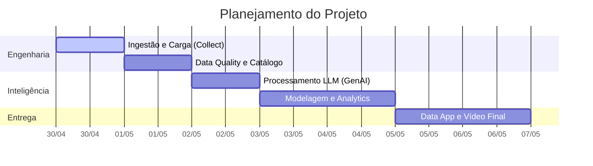
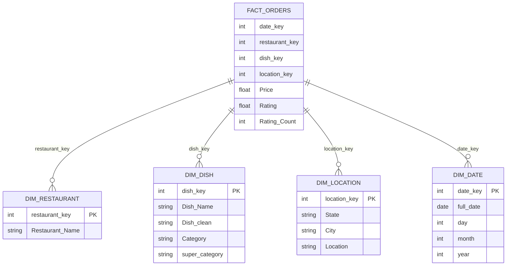

# Case Técnico Dadosfera 

**Domínio Escolhido:** Analytics para Marketplace de Food Delivery.

---

## 📅 Item 0 - Agilidade e Planejamento

Abaixo, o cronograma macro de execução do projeto seguindo as fases do Ciclo de Vida de Dados da Dadosfera e práticas de PMBOK.

## 📥 Item 1 & 2 - Base de Dados e Ingestão (Collect)
*   **Dataset Selecionado:** Swiggy 
  Descrição do Dataset

    Domínio: E-commerce de Food Delivery (Swiggy Marketplace).

    Volume: ~197.430 registros .

    Entidades principais:

        Geografia: State, City, Location.

        Vendedor: Restaurant Name.

        Catálogo: Category, Dish Name.

        Métricas/Performance: Price, Rating, Rating Count.

        Temporal: Order Date.      
*   **Estratégia de Ingestão:** Utilização do módulo **Collect** da Dadosfera para carregamento de raw data (Camada Bronze).

## 🔍 Item 3 & 4 - Catálogo e Data Quality (Explorar)

Para garantir a confiança nos insights gerados, implementei uma camada de **Data Quality** rigorosa utilizando a biblioteca `Great Expectations`.

### Governança e Catálogo:
*   **Identificação:** Os dados foram catalogados na Dadosfera .
*   **Profilagem:** Realizacao de uma análise exploratória de dados (EDA) como etapa inicial para entender a estrutura, resumir características, identificar padrões.

## Regras de Validação (Expectations):
Para garantir que os dados consumidos pelo negócio fossem confiáveis , implementamos umas regras de validacao utilizando Great Expectations.
1.  **Price (INR):** Deve estar entre 0.1 e 10.000 (evitando valores negativos ou erros de input).
2.  **Rating:** Deve estar no intervalo de 1.0 a 5.0.
3.  **Restaurant Name & Order Date:** Proibição de valores nulos (Not Null).

**Resultado da Validação:**
*   **Status:**  Sucesso Geral.Ativos Gerados: O relatório completo de validação foi salvo na pasta quality/relatorio_qualidade.json.
Nesta etapa, demonstramos a capacidade de transformar dados desestruturados em **features inteligentes**, utilizando modelos de linguagem de larga escala (LLMs).

## Item 5 **Processamento com LLMs:**
*   **Enriquecimento:** A ideia era usar um diccionario em python junto com o modelo **Gemini 2.5 Flash** para processar nomes de pratos e descrições textuais.
*   **Extração de Atributos:** Implementação em Python para identificar o **ingrediente principal** e a **classificação** (Vegetariano/Não-Vegetariano).

### **Engenharia de Prompt e Estruturação:**
*   **Prompt Engineering:** Desenvolvimento de instruções específicas para garantir que a IA atuasse como um especialista em culinária indiana. Ex:prompt = f"Retorne um JSON com ingrediente principal e se é veg (true/false) para: {test_dishes}"
## 📐 Item 6 - Modelagem de Dados (Star Schema)

Nesta etapa, estruturamos os dados seguindo a metodologia de **Ralph Kimball**, transformando a tabela flat original em um modelo **Star Schema (Esquema Estrela)**. Esta arquitetura é otimizada para ferramentas de BI como o **Metabase**, garantindo alta performance em consultas analíticas.

### **Modelo Star Schema:**

## 📊 Item 7 - Análise de Dados (Visualizar)

Nesta etapa, utilizamos o **Metabase** integrado à **Dadosfera** para transformar os dados modelados na camada **Gold** em dashboards executivos, focados na geração de insights para tomada de decisão.

### **Queries e Visualizações:**
*   **KPIs de Negócio:** Implementação de indicadores de performance como **Ticket Médio** e **Volume Total de Pedidos** através de agregações SQL na tabela `fact_orders`.
*   **Análise Geográfica:** Visualização da distribuição de vendas por **Estado e Cidade**, permitindo identificar as regiões com maior faturamento e potencial de expansão.
*   **Performance de Culinária:** Gráficos comparativos demonstrando a popularidade de categorias de pratos, integrando os dados enriquecidos pela **GenAI**.
*   **Análise de Satisfação:** Gráfico de dispersão cruzando o **Preço** vs. **Avaliação (Rating)**, identificando o equilíbrio entre custo e qualidade percebida pelo cliente.
